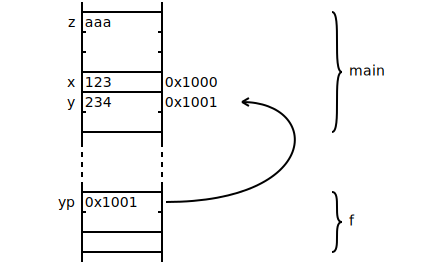

= Memory Layout Diagram
MetroWind <chris.corsair@gmail.com>

This kind of graph is generally used when teaching programming with
C/C++. In this particular graph, there are three variables in function
`main`, namely `z`, `x`, and `y`. The variable `z` is some kind of
3-byte structure with value “zzz”, while `x` is 1 byte with value 123,
and `y` is 2 bytes with value 234. The address of `x` and `y` are also
drawn. At the bottom, there is another function called `f`, in which
sits a pointer `yp`. This diagram makes it clear that the value of
`yp` is the address of `y`, and that the pointer itself is 2 bytes.

In my experience in learning and teaching C, for students new to
programming as well as those who come from non-system languages like
Python, pointer is usually the first real obstacle they would have
difficulty with. Memory layout diagrams like this are thus invaluable
for them to visualize and understand the model of pointers. Therefore
I wrote this program to trivialize the task of drawing memory layout
diagrams. The graph above is generated from this input:

[source,xml]
.`example.mld`
----
<graph>
  <column>
    <scope name="main">
      <cell label="z" size="3">aaa</cell>
      <cell label="x" address="0x1000" size="1">123</cell>
      <cell label="y" address="0x1001" size="2">234</cell>
    </scope>
    <scope name="f">
      <cell label="yp" size="2">0x1001</cell>
      <cell />
    </scope>
    <pointer>
      <from scope="f" cell="yp" />
      <to scope="main" cell="y" />
    </pointer>
  </column>
</graph>
----
